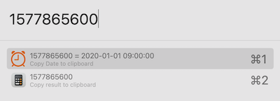
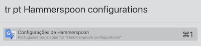

# Configurations for [Hammerspoon](http://www.hammerspoon.org)

Copy the `config.lua.dist` to `config.lua` and adapt to your needs.

The base hotkeys are always the same, configured in the file `config.lua`.
```
config.hyper = {'ctrl', 'alt', 'cmd'}
```

## Features

### Menu

The menu contains an "extended" version that creates items for the window 
movement and applications.


### Window movement

Move and resize windows with hotkeys.

| Hotkey | Direction |
| --- | --- |
| hyper + ← | left |
| hyper + ← + ← | left_half |
| hyper + → | right |
| hyper + → + → | right_half |
| hyper + ↑ | top |
| hyper + ↑ + ↑ | maximize |
| hyper + ↓ | down |
| hyper + ↓ + ↓ | center |
| Menu click | top_right |
| Menu click | top_left |
| Menu click | down_right |
| Menu click | down_left |

### Applications

Set hotkeys to open applications.

Configurable in the `config.lua`.
```
config.applications = {
  I = 'iTerm',
  P = 'PhpStorm',
  L = 'Sublime Text',
}
```

### Caffeine

A menu item (and submenu) that allows to prevent the system from going to sleep
with a timer or indefinitely.

Configurable in the `config.lua`.
```
config.menu.caffeine = {
  {title = '10 minutes', seconds = 600},
  {title = '30 minutes', seconds = 1800},
  {title = '1 hour', seconds = 3600},
  {title = '3 hours', seconds = 10800},
}
```

### Network

Menu items that shows and allows copying when clicked the Wifi name, External IP 
and Internal IP addresses.

### Connected Screens

A menu item that shows the connected displays.

### Reload configurations

When a `.lua` file is changed the configurations will be reloaded.

Hotkey: `hyper + R`

### Audio

Force specific input device to be always used.

Mute automatically when the computer wakes up.

Configurable in the `config.lua`.
```
config.audio.forceInputDevice = 'MacBook Pro Microphone'
config.audio.muteOnAwake = true
```

### Battery

Get notified when: 
- Using an unknown charger (connect the charger and run 
  `hs.battery.psuSerialString()` to check the current serial).
- Battery state is not Good.

Configurable in the `config.lua`.
```
config.battery.serial = ''
config.battery.state = true
```

### Seal plugins

#### Date convert

From Time to Date, type: `1577865600`



From Date to Time, type: `2020-01-01 09:00:00`


#### Google translate 

Translate text directly on Seal/Spotlight.

This plugin requires a [Google API key](https://cloud.google.com/translate/docs/setup) 
and is configurable in the `config.lua`.
```
config.Seal.key = 'SOME-KEY'
```

Usage: Type `tr` following the langcode to which you want to translate the text, and the text to be translate
```
tr [to] [text to translate]
```




### Small improvements on Seal plugins

A [Pull-Request](https://github.com/Hammerspoon/Spoons/pull/221) is open to make 
some improvements in some plugins, check the [patch](./patches/seal-pr-221.patch) 
for more details.

## Update spoons

Run the script `update-spoons.sh`.

This will clone the [Spoons](https://github.com/Hammerspoon/Spoons) repo into a 
temporary folder, apply the patches and copy the result into the `Spoons` folder.
All the un-used Spoons are ignored in the `.gitignore`.
